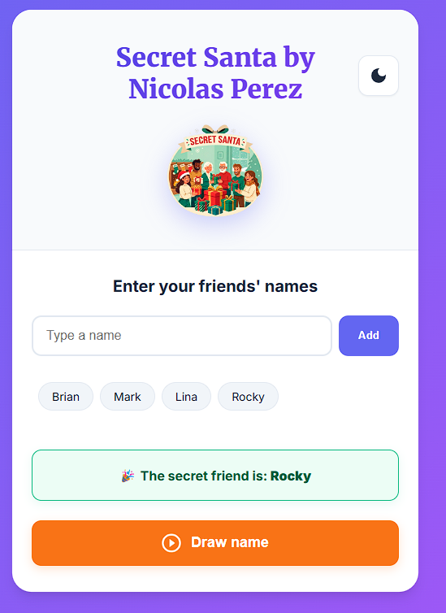

# 🎨 DrawMasterJS

A dynamic and interactive drawing application built with vanilla JavaScript and HTML5 Canvas. **DrawMasterJS** allows users to unleash their creativity through a sleek, responsive interface with real-time brush customization.

<p align="center">
  
</p>

## 🎯 Project Overview
This project was developed to explore the power of the **Canvas API** and state management in JavaScript. It features a clean UI/UX, theme switching capabilities, and precise drawing tools, making it a perfect example of functional and aesthetic frontend development.

## ✨ Key Features
*   **Precision Drawing:** Smooth brush strokes with adjustable thickness and opacity.
*   **Custom Color Palette:** Full hex color support for personalized creations.
*   **Dark/Light Mode:** Seamless theme transitions for comfortable use in any environment.
*   **Canvas Actions:** Clear canvas functionality and image export (PNG) support.
*   **Fully Responsive:** Optimized for both desktop and touch-screen devices.

## 🛠️ Tech Stack
*   **Language:** JavaScript (ES6+)
*   **Rendering:** HTML5 Canvas API
*   **Styling:** CSS3 with Custom Variables (CSS Vars) for theme management.
*   **Structure:** Semantic HTML5

## 🚀 Getting Started

To run this project locally:

1.  **Clone the repository:**
    ```bash
    git clone https://github.com/Nicode1203/amigoSecreto.git
    ```
2.  **Open the project:**
    Simply open `index.html` in your preferred web browser.

## 👨‍💻 Author

**Nicolas Perez Borda (Nico)**
